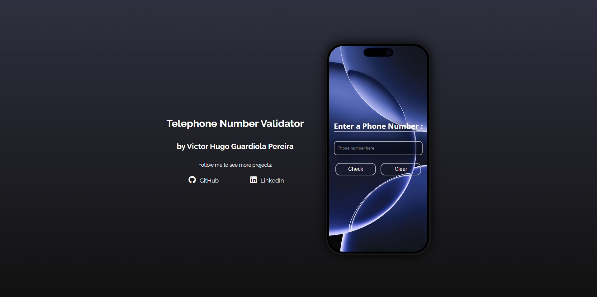

# ☎️ Telephone Number Validator

¡Bienvenido al validador más estadounidense que podrás encontrar!  
Este proyecto te dirá si un número telefónico **"suena" bien** según los estándares de EE. UU. — y lo hace desde dentro de un iPhone 16 Pro digital 🧠📱

---

## 🧠 ¿Qué hace este proyecto?

Verifica si un número telefónico ingresado por el usuario es **válido** en Estados Unidos. Acepta múltiples formatos, pero siempre con reglas claras:

- El **código de área** es obligatorio (por ejemplo, `555`)
- Si se incluye el **código de país**, debe ser **1**
- Se toleran guiones, espacios y paréntesis, siempre que el orden sea correcto

### 📞 Formatos válidos:

- `555-555-5555`
- `(555)555-5555`
- `1 555 555 5555`
- `1(555)555-5555`
- `5555555555`
- ...y otros similares

---

## 📲 ¿Y por qué dentro de un iPhone?

Porque este no es un simple validador de texto.  
La validación sucede dentro de una interfaz inspirada en el **iPhone 16 Pro**, con una animación que simula la **Dynamic Island** al mostrar los resultados.

---

## 🚀 Demo

👉 [Ver proyecto en vivo (GitHub Pages)](https://helixguardi.github.io/Telephone-Number-Validator/)  

---

## 📷 Captura de pantalla

  
_(La interfaz se adapta a pantallas pequeñas, medianas y grandes)_

---

## ⚙️ Tecnologías utilizadas

- **HTML5**  
- **CSS3** (con animaciones personalizadas y diseño responsive)  
- **JavaScript (Vanilla)** – para validación con **expresiones regulares** (regex) y manejo de eventos

---

## 🏗️ Estructura del proyecto

```bash
telephone-number-validator/
│
├── index.html         # Maquetación principal del proyecto
├── Responsive-validator-css.css  # Estilos visuales (con iPhone incluido)
├── script.js          # Lógica de validación con regex + historial de resultados
└── README.md          # Este archivo
